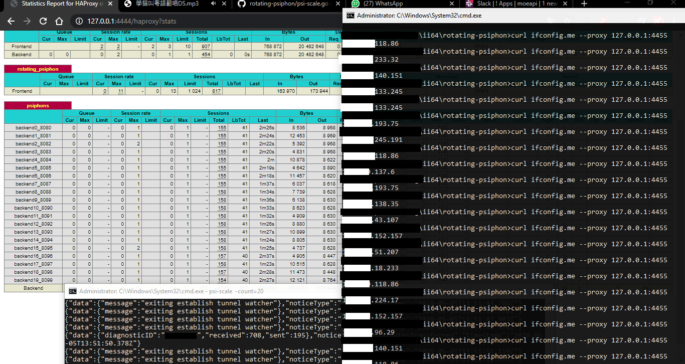

<pre>
damn simple, unclean example of psiphon load balance better performance also with prometheus metrics
---

Docker Image used haproxy:latest that built with prometheus metrics
https://github.com/docker-library/haproxy/blob/eeaaa570ccaeec6fa7e545b9314d6f246b6b283c/2.1/Dockerfile#L39

Maintainer < nekonify@gmail.com >

Direct usage
$ go build -i -v psi-scale.go
$ cp -a haproxy.cfg /etc/haproxy/
$ killall -9 haproxy
$ service haproxy start

haproxy statistic
http://127.0.0.1:4444/haproxy?stats

haproxy pid file
/tmp/haproxy.pid

default front http proxy (haproxy)
*:4455
</pre>

